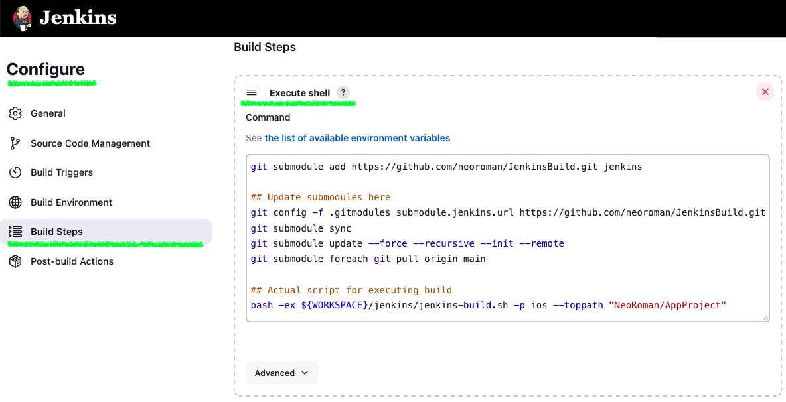

# Application Build BASH Shell Script
Language: BASH Shell Script


## Requirements (based on macOS machine)
- Jenkins server on any macOS machine
-  0. (Mandatory) Install ``Xcode`` command line tools from "https://developer.apple.com/download/more/" for only iOS
-  1. (Mandatory) Install ``jq`` via HomeBrew, brew install jq
-  2. (Mandatory) Install ``bundletool`` for Android AAB output since 2021 Aug, brew install bundletool
-  3. (Optional) Install ``slack`` from "https://github.com/rockymadden/slack-cli"
      (also use "brew install rockymadden/rockymadden/slack-cli"),
      run "slack init", and Enter Slack API token from https://api.slack.com/custom-integrations/legacy-tokens
-  4. (Optional) If using slack, Adjust ``jq`` path as "/usr/local/bin/jq" in "/usr/local/bin/slac"
-  5. (Optional) Install ``gs`` via HomeBrew, brew install gs
-  6. (Optional) Install ``convert``(ImageMagick) via HomeBrew, brew install imagemagick


## Installation
- First you should get it into your iOS or Android source working copy like following:
  ```
    git config --local submodule.rebase true
    git submodule add https://github.com/neoroman/JenkinsBuild.git jenkins
    git submodule init
    git submodule update
  ```
- Add pull rebase true to global configuration of git
  ```
    git config pull.rebase true
  ```


## Jenkins Item Configuration for Build Section
- Just put following line if you don't want add as submodule
  ```
    git submodule add https://github.com/neoroman/JenkinsBuild.git jenkins
  ```

- Update submodule for ``iOS`` into ``{WebServer}/{DocumentRoot}/NeoRoman/AppProject``
  ```
    git config --local submodule.rebase true
    git config -f .gitmodules submodule.jenkins.url https://github.com/neoroman/JenkinsBuild.git
    git submodule sync
    git submodule update --force --recursive --init --remote
    git submodule foreach git pull origin main
    ## Actual script for executing build
    bash -ex ${WORKSPACE}/jenkins/build.sh -p ios --toppath "NeoRoman/AppProject"
  ```
- Update submodule for ``Android`` into ``{WebServer}/{DocumentRoot}/NeoRoman/AppProject``
  ```
    git config --local submodule.rebase true
    git config -f .gitmodules submodule.jenkins.url https://github.com/neoroman/JenkinsBuild.git
    git submodule sync
    git submodule update --force --recursive --init --remote
    git submodule foreach git pull origin main
    ## Actual script for executing build
    bash -ex ${WORKSPACE}/jenkins/build.sh -p android --toppath "NeoRoman/AppProject"
  ```
- Here's a sample screenshot of the jenkins configuration



## Jenkins Item Configuration in jenkins/build.sh configuration for Distribution Sites
  ```
    ## Actual script for executing build
    bash -ex ${WORKSPACE}/jenkins/build.sh -p android --toppath "NeoRoman/AppProject" \
                  --config "${WORKSPACE}/jenkins_config/config.json" \
                  --language "${WORKSPACE}/jenkins_config/lang_ko.json"
  ```
- Add configurations of distribution sites with --config argument.
- Add language for display messages of distribution sites with --language argument.


## Documentation

- 경로·모듈 파일을 옮기거나 이름을 바꿀 때는 **`docs/ARCHITECTURE.md`**, **`docs/CONFIG_AND_SECRETS.md`**, 아래 문서 링크와 **교차 검증**해 같은 PR에서 갱신한다.

- **Architecture & modules**: [docs/ARCHITECTURE.md](docs/ARCHITECTURE.md) — execution flow, platform split, plugin boundaries (Allatori / IxShield / site-specific notify).
- **Secrets & `config.json`**: [docs/CONFIG_AND_SECRETS.md](docs/CONFIG_AND_SECRETS.md) — external config, leakage points, split/merge recommendations. Cross-check keys with `test/config.json` and, if cloned, `working-copy/AngelNet-DistSite/config/config.json` (Forgejo `AngelNet/AngelNet-DistSite`; **no secrets in git**).
- **Ralph refactor PRD**: [docs/RALPH_REFACTOR_TODO.md](docs/RALPH_REFACTOR_TODO.md) — checkbox backlog for `scripts/ralph.sh` (`PRD_PATH` → this file).
- **Ralph automated loop**: [docs/RALPH_AUTOMATED_RUN.md](docs/RALPH_AUTOMATED_RUN.md) — workspace wrapper `~/.openclaw/workspace/scripts/ralph-jenkinsbuild-refactor.sh` (100×5min 등).
- **Platform dry-run checklist**: [docs/DRY_RUN_CHECKLIST.md](docs/DRY_RUN_CHECKLIST.md) — `--dry-run`, `--dry-run-step` 단계별 점검/실행 예시.
- **dist.sh comparison**: [docs/dist_comparison.md](docs/dist_comparison.md)

## Author

ALTERANT /  neoroman@gmail.com


## License

See the [LICENSE](./LICENSE) file for more info.
